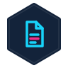

<p align="center">
  
</p>

# Vibe Plugins

**The 626Labs plugin marketplace — one place, the full Vibe ecosystem.**

<p align="center">
  <a href="./.claude-plugin/marketplace.json"></a>
</p>

This repo is the **aggregated marketplace manifest** for 626Labs's family of Claude Code plugins. It exists so a single `owner/repo` paste — `estevanhernandez-stack-ed/vibe-plugins` — gives Claude Code users access to the whole Vibe ecosystem. The actual plugin code lives in dedicated solo repos, linked here via the source entries in `.claude-plugin/marketplace.json`.

The architecture: **foundations underneath, pillars on top.** Foundation tools establish *what* you're working on (knowledge) and *the structural file every agent decision rests on* (CLAUDE.md). Pillar tools shape *how* you work — through the build, after the ship, and across repos.

> Versions below are **live badges** that read each solo repo's latest tag — they can't go stale. The source of truth for what's pinned to stable is always [`.claude-plugin/marketplace.json`](./.claude-plugin/marketplace.json).

## The plugins

### Foundations

| Plugin | Solo repo | Latest | Purpose |
|---|---|---|---|
|  **Thesis Engine** | [`Thesis-Engine`](https://github.com/estevanhernandez-stack-ed/Thesis-Engine) | [](https://github.com/estevanhernandez-stack-ed/Thesis-Engine/tags) | **Knowledge foundation.** Research feeder — discovers cutting-edge topics, gathers primary sources, opposing positions, and methodological precedents across five axes. Emits research notes + a Pandoc-ready BibTeX bibliography. |
|  **Vibe Keystone** | [`vibe-Keystone`](https://github.com/estevanhernandez-stack-ed/vibe-Keystone) | [](https://github.com/estevanhernandez-stack-ed/vibe-Keystone/tags) | **Structural foundation.** Bootstraps a 626Labs-pattern `CLAUDE.md` — the load-bearing file every agent decision rests on. Tenant-aware: interviews for org, decision surface, voice, and persona so the file reflects YOUR conventions. |

### Pillars

| Plugin | Solo repo | Latest | Purpose |
|---|---|---|---|
|  **Vibe Cartographer** | [`vibe-cartographer`](https://github.com/estevanhernandez-stack-ed/vibe-cartographer) | [](https://github.com/estevanhernandez-stack-ed/vibe-cartographer/tags) | Plot your course from idea to shipped app — eight commands (onboard → reflect) plus L3.5 self-evolution. Vibe coding with course correction. |
|  **Vibe Doc** | [`Vibe-Doc`](https://github.com/estevanhernandez-stack-ed/Vibe-Doc) | [](https://github.com/estevanhernandez-stack-ed/Vibe-Doc/tags) | Documentation gap analyzer. Scans, classifies, finds the missing technical docs, generates them from your existing artifacts. |
|  **Vibe Sec** | [`vibe-sec`](https://github.com/estevanhernandez-stack-ed/vibe-sec) | [](https://github.com/estevanhernandez-stack-ed/vibe-sec/tags) | Tier-aware security audit + orchestration. Ten-concern audit (secrets, deps, supply-chain, auth, OWASP survey, threat-model…); defers to gitleaks/OSV/Semgrep/Trivy when present. |
|  **Vibe Test** | [`vibe-test`](https://github.com/estevanhernandez-stack-ed/vibe-test) | [](https://github.com/estevanhernandez-stack-ed/vibe-test/tags) | Test analyzer + generator. Classifies by app type and maturity tier, measures coverage honestly, generates tests proportional to deployment risk — catches the broken harnesses other tools assume away. |
|  **Vibe Prompt** | [`Vibe-Prompt`](https://github.com/estevanhernandez-stack-ed/Vibe-Prompt) | [](https://github.com/estevanhernandez-stack-ed/Vibe-Prompt/tags) | Audit, classify, behaviorally test, grade, remediate, and discover your app's LLM prompts. Inventories every prompt site, fires 13 structural smells (including the prompt-injection family), scores 5 dimensions, and closes the audit-to-fix loop. |
|  **Vibe Iterate** | [`vibe-iterate`](https://github.com/estevanhernandez-stack-ed/vibe-iterate) | [](https://github.com/estevanhernandez-stack-ed/vibe-iterate/tags) | Iterate on a shipped product, one PR at a time. Picks the right mode (feature-add, competitive, ux-polish, bug-bash) with a regression-aware, small-diff posture. |
|  **Vibe Taker** | [`vibe-taker`](https://github.com/estevanhernandez-stack-ed/vibe-taker) | [](https://github.com/estevanhernandez-stack-ed/vibe-taker/tags) | Take it with you. Capture a feature out of one repo as a portable bundle; plant it into another with stack-aware adaptation and a mandatory diff confirmation. |
|  **Vibe Walk** | [`Vibe-Walk`](https://github.com/estevanhernandez-stack-ed/Vibe-Walk) | [](https://github.com/estevanhernandez-stack-ed/Vibe-Walk/tags) | Generate user onboarding — but only when it earns one. Names the aha moment, gives an honest build/don't-build verdict, then ships an instrumented Driver.js tour when warranted. |
|  **Vibe Insights** | [`vibe-insights`](https://github.com/estevanhernandez-stack-ed/vibe-insights) | [](https://github.com/estevanhernandez-stack-ed/vibe-insights/tags) | The deep retrospective for your Claude Code work — coverage, recall, token/cost with the cache reveal, how-you-work, open threads, and a synthesized narrative read across your full history and every machine. Personal by default; optionally keep chosen sources or repos local-only. |
|  **Vibe Wrap** | [`vibe-wrap`](https://github.com/estevanhernandez-stack-ed/vibe-wrap) | [](https://github.com/estevanhernandez-stack-ed/vibe-wrap/tags) | Close the session cleanly — reads the breadcrumb trail your toolkit left, renders a what-shipped handoff, and gates commit/push/decision-log with no-action defaults. Pairs with Insights. |
|  **Vibe Thesis** *(beta)* | [`Vibe-Thesis`](https://github.com/estevanhernandez-stack-ed/Vibe-Thesis) | [](https://github.com/estevanhernandez-stack-ed/Vibe-Thesis/tags) | Long-form academic authoring — dissertations, master's theses, position essays. Scaffolds a styled PDF skeleton + working render pipeline in roughly 30 minutes. |
|  **Vibe Lingual** | [`Vibe-Lingual`](https://github.com/estevanhernandez-stack-ed/Vibe-Lingual) | [](https://github.com/estevanhernandez-stack-ed/Vibe-Lingual/tags) | Localize your app's UI without corrupting its logic. Scans every user-facing string by kind, audits the i18n-retrofit gotchas, then runs a confidence-routed extract → wire → translate → guard loop with per-file backups. Deep on next-intl + App Router. |
|  **Vibe Access** | [`vibe-access`](https://github.com/estevanhernandez-stack-ed/vibe-access) | [](https://github.com/estevanhernandez-stack-ed/vibe-access/tags) | Give agents pipelines into your app — then see the surface an agent actually sees. Maps every callable surface into an agent-access.json manifest, mines the inputs a caller must send, scaffolds what's missing behind hard env gates, and proves it with a cold-agent verify. `:visualize` renders it all — or a live MCP server's tools/list — into one printable HTML sheet: every tool, the call you can make, a real explanation each. |
| **Vibe Glow** | [`vibe-glow`](https://github.com/estevanhernandez-stack-ed/vibe-glow) | [](https://github.com/estevanhernandez-stack-ed/vibe-glow/tags) | Repeatable multi-stage UI beautification campaigns. Four gated stages as slash commands — identity (invent the design language, stress-tested against user theming), audit (five Opus review lenses plus a skeptic pass), wave (findings-driven fix batches re-reviewed until clean), reveal (the flagship release). Evidence adapters for WinUI (PowerShell window capture) and web (Playwright). |

Each plugin is independently versioned. This marketplace pins to **stable tags** on each solo repo; updates are deliberate promotions, not bleeding-edge tracking.

## Two release channels

### 🟢 Stable (this repo) — for most users

Paste `estevanhernandez-stack-ed/vibe-plugins` into Claude Code's Add Marketplace dialog. You get the versions pinned in `marketplace.json` — tested, promoted, stable. New releases land when a `ref` field gets bumped.

### 🟠 Canary / Edge (solo repos) — for beta testers

Paste any individual solo repo URL (`estevanhernandez-stack-ed/vibe-cartographer`, `estevanhernandez-stack-ed/vibe-insights`, etc.) to track that plugin's `main` branch. You see edge work the moment it's pushed. Faster feedback, occasional breakage.

## Install

> **Full install guide with troubleshooting and per-platform notes:** [INSTALL.md](./INSTALL.md). The quick paths below cover the common cases.

### Claude Desktop / Cowork (UI)

1. Personal plugins → **+** → **Add marketplace**
2. Enter: `estevanhernandez-stack-ed/vibe-plugins`
3. Click **Sync**
4. Install whichever plugins you want

### Claude Code CLI

<!-- BEGIN GENERATED:install (scripts/gen-readme-plugins.mjs) -->
```text
/plugin marketplace add estevanhernandez-stack-ed/vibe-plugins
/plugin install thesis-engine@vibe-plugins
/plugin install vibe-keystone@vibe-plugins
/plugin install vibe-cartographer@vibe-plugins
/plugin install vibe-doc@vibe-plugins
/plugin install vibe-sec@vibe-plugins
/plugin install vibe-test@vibe-plugins
/plugin install vibe-prompt@vibe-plugins
/plugin install vibe-iterate@vibe-plugins
/plugin install vibe-taker@vibe-plugins
/plugin install vibe-walk@vibe-plugins
/plugin install vibe-insights@vibe-plugins
/plugin install vibe-wrap@vibe-plugins
/plugin install vibe-thesis@vibe-plugins
/plugin install vibe-lingual@vibe-plugins
/plugin install vibe-access@vibe-plugins
/plugin install vibe-glow@vibe-plugins
```
<!-- END GENERATED:install -->

### CLI packages on npm (for CI pipelines)

Some plugins ship a standalone CLI for headless CI use:

```bash
npm install -g @esthernandez/vibe-test-cli @esthernandez/vibe-sec-cli
vibe-test audit --cwd .
vibe-test gate --ci
vibe-sec scan .
```

> npm package naming across the family is inconsistent and under review — see the npm cohesion sub-project.

## What's actually in this repo

- **`.claude-plugin/marketplace.json`** — the aggregation manifest. Load-bearing file; source of truth for what's pinned to stable.
- **`packages/core/`** — `@626labs/plugin-core`, shared npm package for plugin infrastructure (scanner primitives, session-logger schema, state helpers). Not a plugin; not in the marketplace.
- **`docs/`** — ecosystem-level documentation, migration plan, the Self-Evolving Plugin Framework thesis.
- **Stats snapshots** — daily npm download counts per plugin CLI.

Plugin source code does **not** live here. Find it in the solo repos linked above.

## Promotion from canary → stable

A one-commit change on this repo:

1. Work lands on a solo repo's `main` and gets tagged (`vX.Y.Z`)
2. Edit `.claude-plugin/marketplace.json` — bump that plugin's `ref` field to the new tag
3. Commit + push

Stable-channel users pick up the new version on their next `/plugin marketplace sync`.

## The "Vibe" thesis

AI-assisted creation has predictable patterns of friction — in software (vibe-coded apps cut corners on docs, security, testing, scope discipline) and in long-form authoring (work drifts without a strong stance, fades into self-praise, lacks a research-grounded foundation). The Vibe ecosystem closes those gaps with **foundations underneath and pillars on top**:

- **Foundations.** Establish what you're working on and the structural file every agent decision rests on.
  - **Thesis Engine** — knowledge foundation: research feeder (topics, primary sources, opposing positions, methodology, prior art)
  - **Vibe Keystone** — structural foundation: bootstraps a tenant-aware `CLAUDE.md` so every other plugin operates on a consistent contract
- **Pillars.** Shape how you work — through the build, after the ship, and across repos.
  - **Vibe Cartographer** — plot the course from idea to shipped app (vibe coding course correction)
  - **Vibe Doc** — close the documentation vacuum (ADRs, runbooks, threat models)
  - **Vibe Sec** — close the security vacuum (secrets, auth, input validation, dependencies)
  - **Vibe Test** — close the testing vacuum (smoke → behavioral → edge → integration)
  - **Vibe Prompt** — close the prompt vacuum for your app's LLM features (structural smells, injection resistance, behavioral drift)
  - **Vibe Iterate** — keep improving after the ship, one regression-aware PR at a time
  - **Vibe Taker** — carry a proven feature from one repo into another, adapted to the destination stack
  - **Vibe Walk** — generate user onboarding, but only when the app earns one
  - **Vibe Insights** — see how you actually work across every machine and session
  - **Vibe Wrap** — close the session cleanly: a what-shipped handoff from the trail your toolkit already left
  - **Vibe Thesis** — long-form academic authoring (dissertations, theses, position essays)

Each plugin knows its scope. None pretends to replace specialist tools or professional review. Together they're the baseline hygiene kit for AI-assisted creation in 2026.

## Architecture: classification-driven, tier-appropriate

Every plugin classifies the target work (project type, deployment context, risk profile, audience) and measures against a tier-appropriate bar — not an absolute one. Prototypes get prototype-level scrutiny. Regulated apps get regulated-level scrutiny. Class papers get class-level review; dissertations get dissertation-level review. The plugin tells you what's missing for *your situation*, not for a theoretical ideal.

## Self-Evolving Plugin Framework

All plugins adopt the framework documented at [vibe-cartographer/docs/self-evolving-plugins-framework.md](https://github.com/estevanhernandez-stack-ed/vibe-cartographer/blob/main/docs/self-evolving-plugins-framework.md):

- **Level 1** — Persistent builder profile at `~/.claude/profiles/builder.json`
- **Level 2** — Session memory at `~/.claude/plugins/data/<plugin>/sessions/*.jsonl`
- **Level 3** — Reflective evolution (the plugin reads its own session logs and proposes SKILL improvements)

New Vibe plugins ship with Level 2 from day 1.

## Credits

Built by [626Labs LLC](https://626labs.dev) — Fort Worth, TX.

## License

MIT

## Ecosystem stats

Daily npm download counts for every tracked package are collected by [`scripts/npm-stats.py`](./scripts/npm-stats.py) and committed to [`data/stats/`](./data/stats/) by the `npm download stats` workflow at 14:00 UTC daily. The append-only [`history.jsonl`](./data/stats/history.jsonl) is the long-term data source; `data/stats/YYYY-MM-DD.json` holds the latest daily snapshot.
