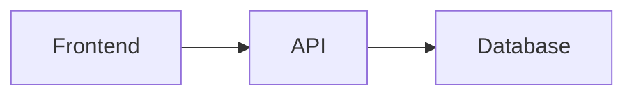

# Default Stack Patterns

These patterns are available as recommendations when no specific architecture docs are provided. If the user has pointed to custom architecture docs, defer to those instead.

## Common Project Architectures

### React/Vite + BaaS
- **When:** Full-stack web app with dynamic data, auth, or real-time features
- **Shape:** React + Vite + Tailwind CSS → Supabase or Firebase (database + auth + storage) → Netlify or Vercel (hosting)
- **Why it works:** Supabase/Firebase handle the entire backend (auth, database, storage) so the builder writes zero backend code. All time goes into the product, not the plumbing.
- **Tradeoffs:** Great for anyone with React experience. Biggest risk: getting lost in BaaS configuration docs.

### Python + Streamlit
- **When:** Data-focused app, AI/ML project, internal tool, or quick proof of concept
- **Shape:** Python script → Streamlit for instant web UI → External APIs (OpenAI, etc.)
- **Why it works:** Streamlit turns any Python script into a web app with zero frontend knowledge. Deploys free on Streamlit Community Cloud.
- **Tradeoffs:** Best for Python users. Limited UI customization. Great for first-timers who want results fast.

### Next.js Full-Stack
- **When:** App needs SSR, API routes, and a polished frontend in one framework
- **Shape:** Next.js (App Router) → API routes or server actions → Database (Prisma + SQLite/Postgres)
- **Why it works:** One framework handles everything. No separate backend setup.
- **Tradeoffs:** Powerful but framework-specific. Only recommend if the builder already knows Next.js or wants to learn it.

### Static Site / Client-Only
- **When:** No backend needed, data is local or from external APIs
- **Shape:** HTML/CSS/JS or React → External APIs or localStorage
- **Good for:** Tools, visualizations, single-user apps, browser extensions
- **Tradeoffs:** Simplest to deploy (GitHub Pages, Vercel). Great for absolute first-timers.

### CLI Tool
- **When:** No UI needed, command-line interface
- **Shape:** Python/Go/Node script with argument parsing
- **Good for:** Automation, file processing, developer tools
- **Tradeoffs:** Fast to build, easy to demo via screen recording. No deployment complexity.

### Bot / Integration
- **When:** API or service consumed by an existing platform (Slack bot, Discord bot, browser extension)
- **Shape:** API server → External platform's UI
- **Good for:** Integrations that extend tools people already use
- **Tradeoffs:** The "frontend" is someone else's problem. Focus on the logic.

## Diagramming

Use whatever format communicates best. Options:

**ASCII box diagrams** — work everywhere, no rendering dependencies:
```
┌──────────┐     ┌──────────┐     ┌──────────┐
│ Frontend │────→│   API    │────→│ Database │
└──────────┘     └──────────┘     └──────────┘
```

**Mermaid** — richer rendering in many tools:


Ask the builder if they have a preference. If they don't care, pick whichever is clearest for the specific diagram.

## File Structure Conventions

Always include a full file tree in the spec. Use ASCII tree format:

```
project/
├── src/
│   ├── components/    # UI components
│   ├── pages/         # Route-level pages
│   ├── lib/           # Shared utilities
│   └── api/           # API routes or client
├── docs/              # Planning artifacts (scope, prd, spec, etc.)
├── process-notes.md   # Process journal
├── package.json
└── README.md
```

Annotate directories with brief comments explaining purpose.

## Data Flow Documentation

For any app with data, document how data moves through the system:
1. Where does data originate? (User input, external API, file, etc.)
2. Where is it stored? (Database, localStorage, in-memory, file)
3. How does it get from A to B? (API call, function call, event, etc.)
4. What transforms happen along the way?
